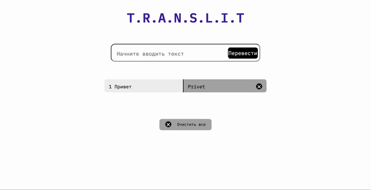

# TranslitApp

## Описание
TranslitApp - это веб-приложение, предназначенное для транслитерации русского текста в латинские символы. Пользователи могут вводить текст на русском языке, и приложение автоматически конвертирует его в транслитерацию, позволяя легко получить представление введенных слов на английском алфавите. 

## Технологии
Приложение разработано с использованием следующих технологий:
- HTML: структура страницы.
- CSS: стилизация приложения.
- JavaScript: логика транслитерации и интерактивные элементы интерфейса.

## Установка и запуск
Для запуска TranslitApp не требуется специальной установки. Достаточно открыть файл `index.html` в любом современном веб-браузере. Приложение готово к использованию сразу после открытия.

### Шаги для запуска:
1. Скачайте и распакуйте архив с файлами проекта на вашем компьютере.
2. Откройте файл `index.html` в вашем веб-браузере.
3. Начните ввод текста в предоставленное текстовое поле и результаты транслитерации будут отображаться автоматически.

